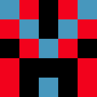
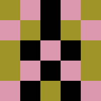
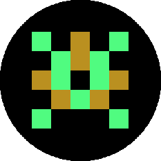
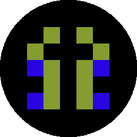

# Avatar Generator
- Generates random pixelated avatar images for you
- Inspired by [this article](https://medium.freecodecamp.org/how-to-create-generative-art-in-less-than-100-lines-of-code-d37f379859f)






## Usage
Compatible for python3
- Install requirements: `pip install Pillow`
- Run in your command line: `python run.py`

Additional arguments:
```
python3 run.py -w 100 -p 10 
               -c 3 -cc '(255,0,0)' '(0,255,0)'
               -o avatars
               -n 10
               -e 
```

### Optional arguments

| Argument        | Default           | Description  |
| ------------------------ |:-------------:| -----|
| -h, --help    |  | show help  |
| -c, --num_colors | 2      | number of colors in avatar to generate (excluding corporate color if any) |
| -w,  --width | 140 | width of avatar to generate |
|-p, --num_pixels | 5 | number of pixels of avatar|
|-cc, --corporate_colors | None |   color(s) to be included (in rgb tuple)
|-n, --number |1| number of avatars to generate
|-o, --output_dest | images| output directory where avatars|
|-e, --encircle |False|flag to determine if avatar generated will be in a square or circle shape|

## Run Test
```
python test.py
```

### Todo
- [ ] Create simple api for this? 
- [x] Create circular avatars