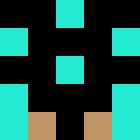
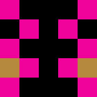

# Avatar Generator
- Generates random pixelated avatar images for you
- Inspired by [this article](https://medium.freecodecamp.org/how-to-create-generative-art-in-less-than-100-lines-of-code-d37f379859f)

## Usage
Compatible for python3
- Install requirements: `pip install Pillow`
- Run in your command line: `python run.py`

### Todo
- [ ] Create simple api for this? 
- [ ] Create circular avatars